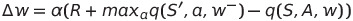

# Implementation details
We developed five learning agents and therefore models in this repository:
* **DQN Network**: The most simplest implementation of a DQN with fixed targets.
* **Double DQN**: Based on the previous one, we implemented a double DQN in order to increase the learning velocity.
* **Dueling DQN**: Based on the simple DQN, we separated the estimation of the state values and action-advantages according 
to the dueling DQN definition.
* **Double Dueling DQN**: This implementation combines the advantages of the two previous ones.
* **Prioritized Replay Experience DQN**: A simple DQN with prioritized replay experience instead of random replay.

The **DQN Network** is the basis of the other four implementations and therefore requires a more detailed explanation. 
DQN Network uses two neural networks as the one in ``models/dqn_model.py``, which are explained below, and a replay 
buffer to sample experiences in a random way. This way of sampling removes the correlation among consecutive experiences.
We use minimal squared error as loss function of our models.

The agent collects experiences in the replay experience buffer and only learns from them after BATCH_SIZE steps. Then, 
the learning function is called, which uses two neural networks. One of them is the one we will use later in the `act` 
function. The other one is used for estimating the ground truth of the state-action value function.  This way of using two neural networks is called fixed target strategy. If you take a look to the following equation you 
will see, that we use the learnt weights when estimating the current value and the expected value of the state-action 
value:


If we want to learn the weights `w`, we can't use them when calculating the ground truth in our loss function. Thus, we
use a second neural network with different weights to estimate this ground truth:



`w-` are the weights we are learning and `w` are the weights of this new neural network. Both of them are randomly
initialized. However, while `w-` values are updated directly with the result of the gradient descent while `w` values
are updated with the following formula:


where &Tau; is a value in `(0, 1)`. Thus, `w` weights follows the same direction as w<sup>-</sup> but in a slower manner.

The `act` function implements an epsilon-greedy strategy. Thus, in a small portion of the cases (so small as the epsilon
value), the agent won't take the learnt state-action value function into account and will chose one action randomly. 
This is to avoid the agents to always follow the same action path and allow it to discover unexplored options.

Each one of the agents is able to solve the environment, i.e., to obtain an average reward of +13 over 100 episodes. All
of them were executed with the same set of hyperparameters:

```python
BUFFER_SIZE = int(np.power(2, 17))  # replay buffer size
BATCH_SIZE = 64  # minibatch size
GAMMA = 0.99  # discount factor
TAU = 1e-3  # for soft update of target parameters
LR = 5e-4  # learning rate
UPDATE_EVERY = 4  # how often to update the network
```

Behind the five above named agents there are two kind of networks described in the <code>models</code> module:
* dqn_model: A neural networks consisting of three linear layers. The amount of neurons for the hidden layers are 
[32, 16, action_size]. Thus, we reduce in the first layer the 37 space dimensions to 32 and continue reducing them until
we reach the dimension of the action space. We use the ReLU activation function after the first two layers. The output
of the last layer is the model output, without activation function. An activation function would clip the output values
among two values, e.g. sigmoid or softmax (0, 1) or tanh (-1, 1). However, a state-action value does not need to be
always in this ranges. Therefore, we do not use any activation function for the last layer.
```
--->space_size--->Linear(space_size, 32)---ReLU()---Linear(32, 16)---ReLU()---Linear(16, action_size)     
```
* dueling_dqn_model: A neural network consisting of four linear layers and a bifurcation following the dueling schema:
```
                                                                                  Linear(16, 1)
                                                                                /                 \        
                                                                               /                   \
                                                                              /                     \
                                                                             /                       \
                                                                            /                         \
--->space_size--->Linear(space_size, 32)---ReLU()---Linear(32, 16)---ReLU()                            +
                                                                            \                         /
                                                                             \                       /
                                                                              Linear(16, action_size)
```

The `output.log` file contains the output of the evaluation.py script. As you can see, all the implemented agents solved
the environment However, the amount of needed episodes is different for each one. Double Dueling DQN was the fastest one
solving the environment in 406 episodes. However, Prioritized Experience Replay was the agent achieving the highest 
average score. Please, see the table below to check the scores and amount of episodes of each agent:

Agent | #Episodes | Avg. Score | Max Avg. Score
----- | --------- | ---------- | --------------
Simple DQN | 501 | 13.02 | 16.45
Double DQN | 446 | 13.01 | 17.06
Dueling DQN | 449 | 13.07 | 16.79
Double Dueling DQN | 406 | 13.02 | 16.96
Prioritized Experience Replay DQN | 412 | 13.02 | 17.90 

Regardless of the amount of episodes, the Prioritized Experience Replay DQN is the slowest one in terms of seconds. The 
way the experiences are sampled increases the time complexity of the algorithm and therefore the time needed for each 
episode.


# Future work
In order to improve the current implementation I would suggest to combine all the improvements we implemented here within
a "Rainbow" agent. 

The implemented neural networks seems to be complex enough to solve the model. I do not expect any 
quick win by increasing the model complexity. An adjustment of hyperparameter could be ever more helpful. 
